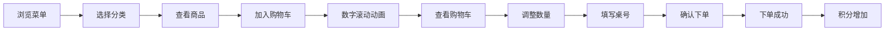

## 1. 产品概述

独立咖啡店点单网页，为到店顾客提供便捷的自助点单服务。顾客可浏览菜单、加入购物车、填写桌号下单，同时可查看会员积分、优惠券、门店导航及本周活动。

- 目标用户：到店消费的咖啡爱好者
- 核心价值：提升点单效率，优化顾客体验，增强会员粘性
- 产品定位：温暖复古风格的精品咖啡店点单系统

## 2. 核心功能

### 2.1 用户角色

| 角色 | 注册方式 | 核心权限 |
|------|----------|----------|
| 顾客 | 自动生成游客身份，可绑定会员 | 浏览菜单、加购下单、查看会员信息 |

### 2.2 功能模块

1. **菜单页面**：分类展示（拿铁、手冲、特调）、商品卡片、加购按钮、数量滚动动画
2. **购物车/下单页面**：商品列表、数量调整、桌号填写、总价计算、确认下单
3. **会员中心**：积分展示、优惠券列表、会员等级
4. **门店导航**：门店地址、地图展示、营业时间
5. **本周活动**：活动列表、活动详情、参与方式
6. **个人资料**：头像、昵称、联系方式、设置

### 2.3 页面详情

| 页面名称 | 模块名称 | 功能描述 |
|----------|----------|----------|
| 菜单页 | 分类导航 | 拿铁/手冲/特调三个分类，点击切换 |
| 菜单页 | 商品卡片 | 商品图片、名称、价格、描述、加购按钮 |
| 菜单页 | 购物车悬浮 | 显示商品数量和总价，点击展开购物车 |
| 购物车页 | 商品列表 | 已选商品、数量加减、删除商品 |
| 购物车页 | 桌号输入 | 输入桌号，确认下单 |
| 会员中心 | 积分面板 | 当前积分、积分明细入口 |
| 会员中心 | 优惠券列表 | 可用优惠券、已使用、已过期 |
| 门店导航 | 门店信息 | 地址、电话、营业时间 |
| 本周活动 | 活动卡片 | 活动海报、标题、时间、详情 |
| 个人资料 | 资料编辑 | 头像、昵称、手机号修改 |

## 3. 核心流程

## 4. 用户界面设计

### 4.1 设计风格

- **主色调**：暖棕色系（深咖 #6F4E37、拿铁棕 #A67B5B、奶白 #F5F0E8）
- **辅助色**：焦糖橙 #D4A574、奶油米 #E8DFD0
- **按钮风格**：圆角矩形，轻微阴影，hover 放大 1.05 倍，过渡动画 0.3s
- **字体**：标题使用衬线字体营造复古感，正文使用无衬线字体保证可读性
- **布局风格**：卡片式布局，卡片带轻微阴影和圆角，页面背景为奶白色
- **图标风格**：线性简约图标，暖棕色配色

### 4.2 页面设计概述

| 页面名称 | 模块名称 | UI 元素 |
|----------|----------|---------|
| 菜单页 | 顶部导航 | Logo、分类标签、购物车图标（带数量角标） |
| 菜单页 | 商品网格 | 两列卡片布局，图片在上，信息在下，右下角加购按钮 |
| 菜单页 | 底部导航 | 菜单、活动、会员、我的四个 Tab |
| 购物车页 | 购物车列表 | 左图右文，数量加减器，删除按钮 |
| 购物车页 | 结算栏 | 固定底部，总价、桌号输入、下单按钮 |
| 会员中心 | 头部卡片 | 会员等级、积分、头像，渐变背景 |
| 会员中心 | 功能入口 | 优惠券、积分明细、我的订单等网格入口 |
| 门店导航 | 地图区域 | 模拟地图、地址信息、导航按钮 |
| 本周活动 | 活动列表 | 竖向卡片列表，海报图 + 标题 + 时间 |
| 个人资料 | 资料表单 | 头像上传、输入框、保存按钮 |

### 4.3 交互动效

- **加购动画**：点击加购按钮，商品数量数字有滚动递增效果
- **按钮 Hover**：放大 1.05 倍，阴影加深，过渡 0.3s ease
- **页面切换**：淡入效果，opacity 0→1，过渡 0.4s ease
- **卡片悬浮**：轻微上浮，阴影加深，过渡 0.3s
- **数量变化**：数字滚动动画，从旧值滚动到新值

### 4.4 响应式

- 以移动端优先设计，同时适配桌面端
- 移动端：单列或两列布局，底部导航
- 桌面端：三到四列布局，侧边导航
- 触控区域不小于 44px，保证触摸友好
