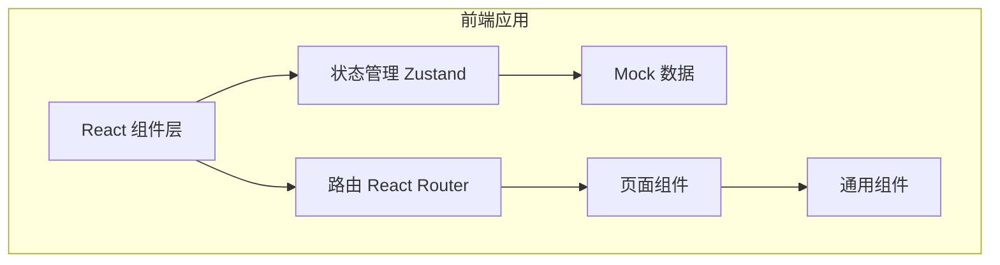
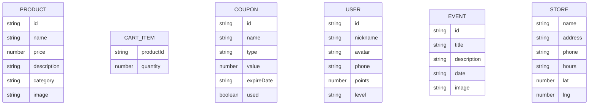

## 1. 架构设计



## 2. 技术描述

- **前端框架**：React@18 + TypeScript
- **构建工具**：Vite@5
- **样式方案**：Tailwind CSS@3
- **状态管理**：Zustand
- **路由方案**：React Router DOM@6
- **图标库**：Lucide React
- **后端**：无（纯前端项目，使用 Mock 数据）
- **数据持久化**：LocalStorage

## 3. 路由定义

| 路由 | 页面 | 说明 |
|------|------|------|
| / | 菜单页 | 首页，展示咖啡菜单分类 |
| /cart | 购物车页 | 查看购物车、填写桌号、下单 |
| /member | 会员中心 | 积分、优惠券、会员功能 |
| /store | 门店导航 | 门店地址、地图、营业时间 |
| /events | 本周活动 | 活动列表、活动详情 |
| /profile | 个人资料 | 用户信息编辑 |

## 4. 数据模型

### 4.1 数据模型定义



### 4.2 数据分类

- **商品分类**：latte（拿铁）、pour-over（手冲）、special（特调）

## 5. 项目结构

```
src/
├── components/          # 通用组件
│   ├── ProductCard.tsx  # 商品卡片
│   ├── CartItem.tsx     # 购物车条目
│   ├── BottomNav.tsx    # 底部导航
│   ├── PageTransition.tsx # 页面过渡动画
│   └── NumberRoller.tsx # 数字滚动组件
├── pages/               # 页面组件
│   ├── Menu.tsx         # 菜单页
│   ├── Cart.tsx         # 购物车页
│   ├── Member.tsx       # 会员中心
│   ├── Store.tsx        # 门店导航
│   ├── Events.tsx       # 本周活动
│   └── Profile.tsx      # 个人资料
├── store/               # 状态管理
│   ├── useCartStore.ts  # 购物车状态
│   └── useUserStore.ts  # 用户状态
├── data/                # Mock 数据
│   ├── products.ts      # 商品数据
│   ├── coupons.ts       # 优惠券数据
│   ├── events.ts        # 活动数据
│   └── store.ts         # 门店数据
├── types/               # 类型定义
│   └── index.ts         # 类型声明
├── App.tsx              # 应用入口
├── main.tsx             # 渲染入口
└── index.css            # 全局样式
```

## 6. 状态管理设计

### 6.1 购物车状态

- 购物车商品列表
- 添加/减少商品数量
- 清空购物车
- 计算总价
- 持久化到 localStorage

### 6.2 用户状态

- 用户信息（昵称、头像、手机号）
- 会员积分
- 会员等级
- 优惠券列表
- 持久化到 localStorage
